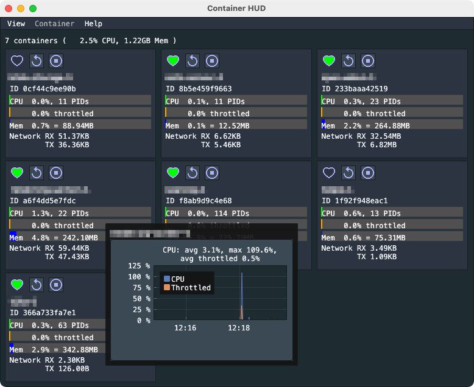

# go-container-hud

A simple UI to show running docker containers with metrics/history for cpu/mem.

Using Docker binding [docker](https://pkg.go.dev/github.com/docker/docker/client)
and Dear ImGui binding [giu](https://pkg.go.dev/github.com/AllenDang/giu)
to create a simple UI
- showing all running containers
  - sort by creation time or name
- showing health status of containers, if available
  - unknown 
  - unhealthy 
  - healthy 
- buttons to
  - restart  container
  - stop  container
- show basic info like container id or image
- cpu bar-graph to show current cpu metric
- hover over cou bar-graph to show history of cpu usage
- memory bar-graph to show current memory metric
- hover over memory bar-graph to show history of memory usage

